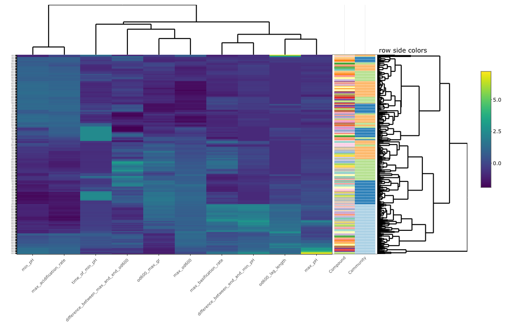

<!-- README.md is generated from README.Rmd. Please edit that file -->

```{r, include = FALSE}
library(DT)
knitr::opts_chunk$set(
  collapse = TRUE,
  comment = "#>",
  fig.path = "man/figures/README-",
  out.width = "100%"
)
```
# phgrofit

phgrofit is a R package designed to provide tools for making kinetic analysis of OD600 and pH data easy.

The motivation for this package comes from the desire to process kinetic pH and OD600 data in a similar manner as in this [paper](https://www.ncbi.nlm.nih.gov/pmc/articles/PMC3187081/). 

In short, this package is designed to take OD600 and pH (gained using the BCECF method described in the paper above) kinetic readouts in either a 96 or 384 well format and process the data, extract physiological parameters, and cluster these parameters to infer relationships between compounds. 

## Installation 

```{r installation, eval = FALSE}
devtools::install_gitlab("cbayne/phgrofit", 
                         auth_token = "Your auth token from gitlab",
                         host = "gitlab.kaleidobio.com")

```

<!-- badges: start -->
<!-- badges: end -->

# Using this package 

First let's load all of the necessary data into R and format the raw data with phgropro.
```{r}
#Loading the necessary data
phgropro_output = phgrofit::phgropro("tests/testdata/G798_Raw_Data.txt","tests/testdata/G798_Metadata.csv",Plate_Type = 384)
```

Now we can model with phgrofit.
```{r}
#Conducting the modeling
phgrofit_output = phgrofit::phgrofit(phgropro_output)
```

Now let's check to see how the model fit is performing using the model_fit_check function

```{r}
phgrofit::model_fit_check(phgropro_output,grouping_vars = c("Community"))
```

^ Here we are just looking at an example for each community, but you can adjust the  grouping_vars to display plots for any combination of variables that you may wish to see

Now lets look to see how the data clusters. Here we can color by compound and community. In this README, you will only see a static image because the function returns a html file that can not be viewed in the format of this README. When you go to use the function in your R session it will return a interactive plotly image 

```{r,eval = FALSE}
p1 = phgrofit::heatmapper(phgrofit_output,labels = c("Compound","Community"))
p1
```


Lastly, let's generate a PCA plot. Here we can see the 95% confidence interval for any group we would like to specify. In this example, let's color by community 

```{r}
p1 = phgrofit::PCA(phgrofit_output,"Community")
p1
```


# Function List 

1. phgropro() : Used to process kinetic pH and OD600 data resulting from a standardized export from the Biotek Gen5 software and combine with user supplied metadata. 

2. phgrofit() : Takes the output of phgrofit::phgropro()) and extracts relevant physiological parameters by conducting spline interpolation. 

3. model_fit_check(): Allows for visual checking of the modeling fit by printing graphs for the combination of conditions the user supplies.

3. heatmapper(): Creates an interactive heat map with associated dendogram that has colored bars based on user input. 

5. PCA(): Visualizes t

Also included are some helper functions that are phgrobiome relies on.

## phgropro() 

Processes data from a biotek plate reader into a tidy format "Sample.ID", "Time", "OD600", and "pH". This function only works with the specific format of exported .txt file type, and there are many possible combinations that could be exported using the Gen5 software. The correct file input can be generated by using either the 96 or 384 well versions of the biotek protocol template found in the folder of the phgrofit repo named biotek_export_protocols.

**Input:**  
*biotek_export* : A specifically formatted .txt file resulting from an export of data using the biotek GEN5 software.

*Plate_Type*, 96 or 384 to specify the type of plate that was run on the plate reader. **It is crucial to specify the correct plate type.**  

**Output:**
A tidy data frame containing the columns "Sample.ID", "Time", "OD600", "pH". Each row is an observation at a given time point. 

**Examples:**

## phgrofit() 

Uses [spline interpolation](https://en.wikipedia.org/wiki/Spline_interpolation) to extract physiological parameters from kinetic OD600 and pH curves. This is intended to be robust across all types of kinetic OD600 and pH curves. 

The parameters that are extracted from the spline interpolation are as follows:

**Input:**  

1. phgropro_output: This is the input data that has been loaded into r that you would like to model. It is a tidy data frame containing a column for Sample.ID, OD600,pH, and time. This will most often be the output off phgropro.  

**Output:** A tidy data frame of 8 values extracted from the spline interpolation.

1. "od600_lag_length". This is the length of the calculated lag phase. Calculated by determining the time where the tangent line at the point of the max growth rate meets the starting od600

2. "od600_max_gr" This is the maximum growth rate that is observed. Calculated by determining the max derivative of the spline fit for OD600

3. "max_od600" This is the maximum od600 observed by the spline fit

4. "difference_between_max_and_end_od600" This is the difference between the maximum and end od600. Higher values should correspond to a "death phase". Or one could argue the cells are getting smaller.

5. "max acidification rate" This is the max acidification rate observed in the spline fit. Calculated by determining the min derivative of the spline fit for pH.

6. "min pH" This is the minimum pH that is observed in the spline fit.

7. "time_of_min_pH " This is the time that the minimum pH occurs in the spline fit.

8. "max_basification_rate" This is the max basification rate observed in the spline fit. Calculated by determining the max derivative of the spline fit for pH.

9. "max_pH" This is the max pH observed in the spline fit.

10. "difference_between_end_and_min_pH" This is the difference between the end and the minimum pH. A higher value corresponds to a greater pH increase. Higher values may reflect an increased proteolytic state.

## heatmapper 

This function creates an interactive heat map with user specified colored categorical labels.

**Input:**  
1. phgrofit_output: output of phgrofit_output.
2. labels: a vector of categorical variables that you would like to display colored bars of.

**Output:**  
1. a plotly heat map created via heatmaply.  


## PCA 
**Input:**  
1. phgrofit_output: output of phgrofit_output.
2. group: a string specifying the name of the column that you would like to color by

**Output:**  
1. a ggplot2 object, with colors and 95% confidence intervals shown for the groups that you have specified.
