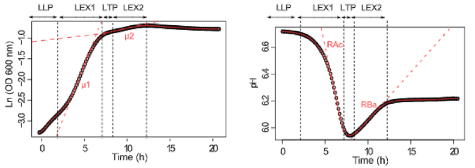

<!-- README.md is generated from README.Rmd. Please edit that file -->
phgrofit
========

phgrofit is a R package designed to provide tools for making kinetic analysis of OD600 and pH data easy.

The motivation for this package comes from the desire to process kinetic pH and OD600 data as described in this published [paper](https://www.ncbi.nlm.nih.gov/pmc/articles/PMC3187081/).

In short, this package is designed to take OD600 and pH (gained using the BCECF method described in the paper above) kinetic readouts in either a 96 or 384 well format and process the data, extract physiological parameters, and cluster these parameters to infer relationships between compounds.

Installation
------------

``` r
install.packages("devtools")
devtools::install_git('cbayne/phgrofit', auth_user = <USER_NAME>, password = <PW>)
```

<!-- badges: start -->
<!-- badges: end -->
Function List
=============

phgropro() : used to process kinetic pH and OD600 data resulting from a standardized export from the Biotek Gen5 software.

phgrofit() : used to take a tidy data frame containing Sample\_ID, Time, pH, and OD600 and extract relevant physiological parameters by conducting spline interpolation.

phgropro()
----------

Processes data from a biotek plate reader into a tidy format "Sample.ID", "Time", "OD600", and "pH". This function only works with the specific format of exported .txt file type, and there are many possible combinations that could be exported using the Gen5 software. The correct file input is described in the input section below.

**Input:**
*biotek\_export* : A specifically formatted .txt file resulting from an export of data using the biotek GEN5 software.

-   This file should have 97 columns if data from a 96 well plate and 385 if the data is from a 384 well plate.

-   Due to the way that the GEN5 software exports data, the OD600 data is contained in a matrix where column 1 is the time, and column 2: number of wells + 1 contain the OD600 data.

-   The pH data has been calculated within the GEN5 software before export using a logistic regression from samples on a calibration plate. It is stored in a similar matrix to the OD600 data.

-   The thing that is most important when using phgropro is the spacing of the exported file. Above the matrix containing OD600 values, there is some data containing relevant information about the plate. The rows of this file arranged in the following manner:

1.  **Top Row (\#x):** *Field group:*, Artifact from GEN5 export
2.  **Row (\#x + 1):** *Plate ID:*, Contains information about the plate
3.  **Row (\#x + 2):** *Empty*
4.  **Row (\#x + 3):** *Empty*
5.  **Row (\#x + 4):** *OD600:600*, Specifies that the below measurements are OD600
6.  **Row (\#x + 5):** \*Time and well name columns, this acts as a header.
7.  **Row (\#x + 6 - \#x + 6 + number of timepoints):** OD600 values.
8.  **Row (\#x + 6 + number of timepoints + 1):** pH\_Final, specifies that the measurements below are pH
9.  **Row (\#x + 6 + number of timepoints + 2):** Time and well name columns, this acts as a header.
10. **Row (\#x + 6 + number of timepoints + 3 - \#x + 6 + (2 x number of timepoints) + 3 ):** pH values

This pattern then repeats for the number of plates in the experiment

*This explanation ended up being pretty confusing. At the very bottom of this document in the "\#phgropro .txt input" section you can find an example file containing all the rows and first 5 columns of the exported data once it is loaded into R. It needs to be in this format to work.*

*Plate\_Type*, 96 or 384 to specify the type of plate that was run on the plate reader. **It is crucial to specify the correct plate type.**

**Output:** A tidy data frame containing the columns "Sample.ID", "Time", "OD600", "pH". Each row is an observation at a given time point.

**Examples:**

``` r
#This code processes exported data from a 96 well plate and assigns it to a tidy data frame called output.
output = phgropro(pathtofile.txt,Plate_Type = 96)
```

phgrofit()
----------

Uses [spline interpolation](physiologcihttps://en.wikipedia.org/wiki/Spline_interpolation) to extract physiological parameters from kinetic OD600 and pH curves.

**Input:**
1. data = A tidy data frame containing columns labeled "Sample.ID", "Time", "OD600", and "pH". This will most often be the output of phgropro.
2. graphs = the number of randomly sampled graphs displaying the fit and relevant parameters that you would like to spot check.

**Output:** A tidy data frame of 8 values extracted from the spline interpolation.If graphs &gt; 0 then x number of randomly sampled graphs are printed to the console displaying the model fit and relevant parameters.

1.  u1" max growth rate during LEX1.
2.  "u2" max growth rate during LEX2.
3.  "RAc" max rate of acidification during LEX1
4.  "RBa" max rate of basification during LEX2
5.  "LLP\_length" length of lag phase
6.  "LEX1\_length" length of first growth phase 7."LTP\_length " length of transition phase 8."LEX2\_length" length of 2nd growth phase occurring during the basification.

 **Examples.**

``` r
#This code condct spline interpolation from data called tidydata here and extracts the relevant parameters to a data table called output. 10 randomly sampled graphs are printed to the console for spot checking. 
output = phgrofit(data=tidydata,graphs = 10)
```

phgropro .txt input
===================

``` r
biotek_export = "tests/testdata/phgropro_96_test.txt"
raw_data = read.delim(biotek_export,row.names = NULL,header = FALSE,col.names = 1:97,na.strings = c("?????",""),stringsAsFactors = FALSE)

print(raw_data[,1:5])
#>              X1       X2    X3    X4    X5
#> 1   Field Group     <NA>  <NA>  <NA>  <NA>
#> 2     Plate ID: G786.p1.  <NA>  <NA>  <NA>
#> 3          <NA>     <NA>  <NA>  <NA>  <NA>
#> 4          <NA>     <NA>  <NA>  <NA>  <NA>
#> 5     OD600:600     <NA>  <NA>  <NA>  <NA>
#> 6          Time       A1    A2    A3    A4
#> 7       0:00:00    0.038 0.038 0.037 0.036
#> 8       0:15:02    0.038 0.038 0.037 0.036
#> 9       0:30:02    0.038 0.038 0.037 0.036
#> 10      0:45:04    0.038 0.038 0.038 0.036
#> 11      1:00:04    0.038 0.038 0.037 0.036
#> 12      1:15:06    0.038 0.038 0.037 0.036
#> 13      1:30:06    0.038 0.038 0.038 0.036
#> 14      1:45:06    0.038 0.038 0.038 0.036
#> 15      2:00:07    0.038 0.038 0.038 0.036
#> 16      2:15:09    0.038 0.038 0.038 0.037
#> 17      2:30:10    0.038 0.038 0.038 0.037
#> 18      2:45:10    0.038 0.038 0.038 0.036
#> 19      3:00:12    0.038 0.038 0.038 0.036
#> 20      3:15:12    0.038 0.038 0.038 0.037
#> 21      3:30:13    0.038 0.038 0.038 0.036
#> 22      3:45:14    0.038 0.038 0.038 0.036
#> 23      4:00:14    0.038 0.038 0.038 0.036
#> 24      4:15:15    0.038 0.038 0.038 0.036
#> 25      4:30:16    0.038 0.038 0.038 0.036
#> 26      4:45:17    0.038 0.038 0.038 0.036
#> 27      5:00:19    0.038 0.038 0.038 0.036
#> 28      5:15:19    0.038 0.038 0.038 0.036
#> 29      5:30:21    0.038 0.038 0.037 0.036
#> 30      5:45:22    0.038 0.038 0.038 0.036
#> 31      6:00:22    0.038 0.038 0.038 0.036
#> 32      6:15:23    0.038 0.038 0.038 0.036
#> 33      6:30:23    0.038 0.038 0.038 0.036
#> 34      6:45:25    0.038 0.038 0.038 0.036
#> 35      7:00:25    0.038 0.038 0.038 0.036
#> 36      7:15:26    0.038 0.038 0.038 0.036
#> 37      7:30:27    0.038 0.038 0.038 0.036
#> 38      7:45:29    0.038 0.038 0.038 0.036
#> 39      8:00:29    0.038 0.038 0.038 0.036
#> 40      8:15:30    0.038 0.038 0.038 0.036
#> 41      8:30:31    0.038 0.038 0.038 0.036
#> 42      8:45:33    0.038 0.038 0.038 0.036
#> 43      9:00:32    0.038 0.038 0.038 0.036
#> 44      9:15:33    0.038 0.038 0.038 0.036
#> 45      9:30:35    0.038 0.038 0.038 0.036
#> 46      9:45:35    0.038 0.038 0.038 0.036
#> 47     10:00:37    0.038 0.038 0.038 0.036
#> 48     10:15:37    0.038 0.038 0.038 0.036
#> 49     10:30:38    0.038 0.038 0.038 0.036
#> 50     10:45:39    0.038 0.038 0.038 0.036
#> 51     11:00:40    0.038 0.038 0.038 0.036
#> 52     11:15:41    0.038 0.038 0.038 0.036
#> 53     11:30:41    0.038 0.038 0.038 0.036
#> 54     11:45:43    0.038 0.038 0.038 0.036
#> 55     12:00:43    0.038 0.038 0.038 0.036
#> 56     12:15:44    0.038 0.038 0.038 0.036
#> 57     12:30:45    0.038 0.038 0.038 0.036
#> 58     12:45:46    0.038 0.038 0.038 0.036
#> 59     13:00:47    0.038 0.038 0.038 0.036
#> 60     13:15:49    0.038 0.038 0.038 0.036
#> 61     13:30:49    0.038 0.038 0.038 0.036
#> 62     13:45:49    0.038 0.038 0.038 0.036
#> 63     14:00:51    0.038 0.038 0.038 0.036
#> 64     14:15:51    0.038 0.038 0.038 0.036
#> 65     14:30:52    0.038 0.038 0.038 0.036
#> 66     14:45:53    0.038 0.038 0.037 0.036
#> 67      0:00:00     <NA>  <NA>  <NA>  <NA>
#> 68      0:00:00     <NA>  <NA>  <NA>  <NA>
#> 69      0:00:00     <NA>  <NA>  <NA>  <NA>
#> 70      0:00:00     <NA>  <NA>  <NA>  <NA>
#> 71      0:00:00     <NA>  <NA>  <NA>  <NA>
#> 72      0:00:00     <NA>  <NA>  <NA>  <NA>
#> 73      0:00:00     <NA>  <NA>  <NA>  <NA>
#> 74      0:00:00     <NA>  <NA>  <NA>  <NA>
#> 75      0:00:00     <NA>  <NA>  <NA>  <NA>
#> 76      0:00:00     <NA>  <NA>  <NA>  <NA>
#> 77      0:00:00     <NA>  <NA>  <NA>  <NA>
#> 78      0:00:00     <NA>  <NA>  <NA>  <NA>
#> 79      0:00:00     <NA>  <NA>  <NA>  <NA>
#> 80      0:00:00     <NA>  <NA>  <NA>  <NA>
#> 81      0:00:00     <NA>  <NA>  <NA>  <NA>
#> 82      0:00:00     <NA>  <NA>  <NA>  <NA>
#> 83      0:00:00     <NA>  <NA>  <NA>  <NA>
#> 84      0:00:00     <NA>  <NA>  <NA>  <NA>
#> 85      0:00:00     <NA>  <NA>  <NA>  <NA>
#> 86      0:00:00     <NA>  <NA>  <NA>  <NA>
#> 87      0:00:00     <NA>  <NA>  <NA>  <NA>
#> 88      0:00:00     <NA>  <NA>  <NA>  <NA>
#> 89      0:00:00     <NA>  <NA>  <NA>  <NA>
#> 90      0:00:00     <NA>  <NA>  <NA>  <NA>
#> 91      0:00:00     <NA>  <NA>  <NA>  <NA>
#> 92      0:00:00     <NA>  <NA>  <NA>  <NA>
#> 93      0:00:00     <NA>  <NA>  <NA>  <NA>
#> 94      0:00:00     <NA>  <NA>  <NA>  <NA>
#> 95      0:00:00     <NA>  <NA>  <NA>  <NA>
#> 96      0:00:00     <NA>  <NA>  <NA>  <NA>
#> 97      0:00:00     <NA>  <NA>  <NA>  <NA>
#> 98      0:00:00     <NA>  <NA>  <NA>  <NA>
#> 99      0:00:00     <NA>  <NA>  <NA>  <NA>
#> 100     0:00:00     <NA>  <NA>  <NA>  <NA>
#> 101     0:00:00     <NA>  <NA>  <NA>  <NA>
#> 102     0:00:00     <NA>  <NA>  <NA>  <NA>
#> 103     0:00:00     <NA>  <NA>  <NA>  <NA>
#> 104     0:00:00     <NA>  <NA>  <NA>  <NA>
#> 105     0:00:00     <NA>  <NA>  <NA>  <NA>
#> 106     0:00:00     <NA>  <NA>  <NA>  <NA>
#> 107     0:00:00     <NA>  <NA>  <NA>  <NA>
#> 108     0:00:00     <NA>  <NA>  <NA>  <NA>
#> 109     0:00:00     <NA>  <NA>  <NA>  <NA>
#> 110     0:00:00     <NA>  <NA>  <NA>  <NA>
#> 111     0:00:00     <NA>  <NA>  <NA>  <NA>
#> 112     0:00:00     <NA>  <NA>  <NA>  <NA>
#> 113     0:00:00     <NA>  <NA>  <NA>  <NA>
#> 114     0:00:00     <NA>  <NA>  <NA>  <NA>
#> 115     0:00:00     <NA>  <NA>  <NA>  <NA>
#> 116     0:00:00     <NA>  <NA>  <NA>  <NA>
#> 117     0:00:00     <NA>  <NA>  <NA>  <NA>
#> 118     0:00:00     <NA>  <NA>  <NA>  <NA>
#> 119     0:00:00     <NA>  <NA>  <NA>  <NA>
#> 120     0:00:00     <NA>  <NA>  <NA>  <NA>
#> 121     0:00:00     <NA>  <NA>  <NA>  <NA>
#> 122     0:00:00     <NA>  <NA>  <NA>  <NA>
#> 123     0:00:00     <NA>  <NA>  <NA>  <NA>
#> 124     0:00:00     <NA>  <NA>  <NA>  <NA>
#> 125     0:00:00     <NA>  <NA>  <NA>  <NA>
#> 126     0:00:00     <NA>  <NA>  <NA>  <NA>
#> 127     0:00:00     <NA>  <NA>  <NA>  <NA>
#> 128     0:00:00     <NA>  <NA>  <NA>  <NA>
#> 129     0:00:00     <NA>  <NA>  <NA>  <NA>
#> 130     0:00:00     <NA>  <NA>  <NA>  <NA>
#> 131     0:00:00     <NA>  <NA>  <NA>  <NA>
#> 132     0:00:00     <NA>  <NA>  <NA>  <NA>
#> 133     0:00:00     <NA>  <NA>  <NA>  <NA>
#> 134     0:00:00     <NA>  <NA>  <NA>  <NA>
#> 135     0:00:00     <NA>  <NA>  <NA>  <NA>
#> 136     0:00:00     <NA>  <NA>  <NA>  <NA>
#> 137     0:00:00     <NA>  <NA>  <NA>  <NA>
#> 138     0:00:00     <NA>  <NA>  <NA>  <NA>
#> 139     0:00:00     <NA>  <NA>  <NA>  <NA>
#> 140     0:00:00     <NA>  <NA>  <NA>  <NA>
#> 141     0:00:00     <NA>  <NA>  <NA>  <NA>
#> 142     0:00:00     <NA>  <NA>  <NA>  <NA>
#> 143     0:00:00     <NA>  <NA>  <NA>  <NA>
#> 144     0:00:00     <NA>  <NA>  <NA>  <NA>
#> 145     0:00:00     <NA>  <NA>  <NA>  <NA>
#> 146     0:00:00     <NA>  <NA>  <NA>  <NA>
#> 147     0:00:00     <NA>  <NA>  <NA>  <NA>
#> 148     0:00:00     <NA>  <NA>  <NA>  <NA>
#> 149     0:00:00     <NA>  <NA>  <NA>  <NA>
#> 150     0:00:00     <NA>  <NA>  <NA>  <NA>
#> 151     0:00:00     <NA>  <NA>  <NA>  <NA>
#> 152     0:00:00     <NA>  <NA>  <NA>  <NA>
#> 153     0:00:00     <NA>  <NA>  <NA>  <NA>
#> 154     0:00:00     <NA>  <NA>  <NA>  <NA>
#> 155     0:00:00     <NA>  <NA>  <NA>  <NA>
#> 156     0:00:00     <NA>  <NA>  <NA>  <NA>
#> 157     0:00:00     <NA>  <NA>  <NA>  <NA>
#> 158     0:00:00     <NA>  <NA>  <NA>  <NA>
#> 159     0:00:00     <NA>  <NA>  <NA>  <NA>
#> 160     0:00:00     <NA>  <NA>  <NA>  <NA>
#> 161     0:00:00     <NA>  <NA>  <NA>  <NA>
#> 162     0:00:00     <NA>  <NA>  <NA>  <NA>
#> 163     0:00:00     <NA>  <NA>  <NA>  <NA>
#> 164     0:00:00     <NA>  <NA>  <NA>  <NA>
#> 165     0:00:00     <NA>  <NA>  <NA>  <NA>
#> 166     0:00:00     <NA>  <NA>  <NA>  <NA>
#> 167     0:00:00     <NA>  <NA>  <NA>  <NA>
#> 168     0:00:00     <NA>  <NA>  <NA>  <NA>
#> 169     0:00:00     <NA>  <NA>  <NA>  <NA>
#> 170     0:00:00     <NA>  <NA>  <NA>  <NA>
#> 171     0:00:00     <NA>  <NA>  <NA>  <NA>
#> 172     0:00:00     <NA>  <NA>  <NA>  <NA>
#> 173     0:00:00     <NA>  <NA>  <NA>  <NA>
#> 174     0:00:00     <NA>  <NA>  <NA>  <NA>
#> 175     0:00:00     <NA>  <NA>  <NA>  <NA>
#> 176     0:00:00     <NA>  <NA>  <NA>  <NA>
#> 177     0:00:00     <NA>  <NA>  <NA>  <NA>
#> 178     0:00:00     <NA>  <NA>  <NA>  <NA>
#> 179     0:00:00     <NA>  <NA>  <NA>  <NA>
#> 180     0:00:00     <NA>  <NA>  <NA>  <NA>
#> 181     0:00:00     <NA>  <NA>  <NA>  <NA>
#> 182     0:00:00     <NA>  <NA>  <NA>  <NA>
#> 183     0:00:00     <NA>  <NA>  <NA>  <NA>
#> 184     0:00:00     <NA>  <NA>  <NA>  <NA>
#> 185     0:00:00     <NA>  <NA>  <NA>  <NA>
#> 186     0:00:00     <NA>  <NA>  <NA>  <NA>
#> 187     0:00:00     <NA>  <NA>  <NA>  <NA>
#> 188     0:00:00     <NA>  <NA>  <NA>  <NA>
#> 189     0:00:00     <NA>  <NA>  <NA>  <NA>
#> 190     0:00:00     <NA>  <NA>  <NA>  <NA>
#> 191     0:00:00     <NA>  <NA>  <NA>  <NA>
#> 192     0:00:00     <NA>  <NA>  <NA>  <NA>
#> 193     0:00:00     <NA>  <NA>  <NA>  <NA>
#> 194     0:00:00     <NA>  <NA>  <NA>  <NA>
#> 195     0:00:00     <NA>  <NA>  <NA>  <NA>
#> 196     0:00:00     <NA>  <NA>  <NA>  <NA>
#> 197     0:00:00     <NA>  <NA>  <NA>  <NA>
#> 198     0:00:00     <NA>  <NA>  <NA>  <NA>
#> 199     0:00:00     <NA>  <NA>  <NA>  <NA>
#> 200    pH_Final     <NA>  <NA>  <NA>  <NA>
#> 201        Time       A1    A2    A3    A4
#> 202     0:01:09     <NA>  <NA> 5.491 5.492
#> 203     0:16:11     <NA>  <NA> 5.483 5.490
#> 204     0:31:11     <NA>  <NA> 5.483 5.474
#> 205     0:46:13     <NA>  <NA> 5.493 5.505
#> 206     1:01:13     <NA>  <NA> 5.483 5.480
#> 207     1:16:15     <NA>  <NA> 5.480 5.486
#> 208     1:31:15     <NA>  <NA> 5.498 5.485
#> 209     1:46:15     <NA>  <NA> 5.487 5.478
#> 210     2:01:16     <NA>  <NA> 5.510 5.499
#> 211     2:16:18     <NA>  <NA> 5.503 5.490
#> 212     2:31:18     <NA>  <NA> 5.483 5.503
#> 213     2:46:19     <NA>  <NA> 5.485 5.491
#> 214     3:01:21     <NA>  <NA> 5.489 5.501
#> 215     3:16:21     <NA>  <NA> 5.496 5.493
#> 216     3:31:22     <NA>  <NA> 5.510 5.486
#> 217     3:46:23     <NA>  <NA> 5.486 5.488
#> 218     4:01:23     <NA>  <NA> 5.487 5.492
#> 219     4:16:24     <NA>  <NA> 5.492 5.490
#> 220     4:31:25     <NA>  <NA> 5.480 5.491
#> 221     4:46:26     <NA>  <NA> 5.479 5.484
#> 222     5:01:28     <NA>  <NA> 5.507 5.498
#> 223     5:16:28     <NA>  <NA> 5.496 5.508
#> 224     5:31:29     <NA>  <NA> 5.502 5.498
#> 225     5:46:31     <NA>  <NA> 5.473 5.488
#> 226     6:01:31     <NA>  <NA> 5.497 5.484
#> 227     6:16:32     <NA>  <NA> 5.494 5.492
#> 228     6:31:32     <NA>  <NA> 5.471 5.491
#> 229     6:46:33     <NA>  <NA> 5.503 5.498
#> 230     7:01:34     <NA>  <NA> 5.500 5.490
#> 231     7:16:35     <NA>  <NA> 5.487 5.476
#> 232     7:31:36     <NA>  <NA> 5.497 5.490
#> 233     7:46:38     <NA>  <NA> 5.485 5.499
#> 234     8:01:38     <NA>  <NA> 5.493 5.505
#> 235     8:16:39     <NA>  <NA> 5.506 5.470
#> 236     8:31:40     <NA>  <NA> 5.501 5.502
#> 237     8:46:42     <NA>  <NA> 5.482 5.493
#> 238     9:01:41     <NA>  <NA> 5.504 5.494
#> 239     9:16:42     <NA>  <NA> 5.492 5.492
#> 240     9:31:43     <NA>  <NA> 5.491 5.488
#> 241     9:46:44     <NA>  <NA> 5.496 5.472
#> 242    10:01:45     <NA>  <NA> 5.496 5.483
#> 243    10:16:46     <NA>  <NA> 5.485 5.487
#> 244    10:31:47     <NA>  <NA> 5.488 5.487
#> 245    10:46:48     <NA>  <NA> 5.487 5.488
#> 246    11:01:49     <NA>  <NA> 5.496 5.488
#> 247    11:16:49     <NA>  <NA> 5.487 5.485
#> 248    11:31:50     <NA>  <NA> 5.487 5.494
#> 249    11:46:51     <NA>  <NA> 5.473 5.500
#> 250    12:01:52     <NA>  <NA> 5.491 5.491
#> 251    12:16:53     <NA>  <NA> 5.485 5.486
#> 252    12:31:54     <NA>  <NA> 5.484 5.487
#> 253    12:46:55     <NA>  <NA> 5.479 5.494
#> 254    13:01:56     <NA>  <NA> 5.471 5.492
#> 255    13:16:57     <NA>  <NA> 5.490 5.491
#> 256    13:31:58     <NA>  <NA> 5.489 5.500
#> 257    13:46:58     <NA>  <NA> 5.496 5.495
#> 258    14:01:59     <NA>  <NA> 5.493 5.487
#> 259    14:17:00     <NA>  <NA> 5.487 5.484
#> 260    14:32:01     <NA>  <NA> 5.481 5.481
#> 261    14:47:02     <NA>  <NA> 5.502 5.486
#> 262     0:00:00     <NA>  <NA>  <NA>  <NA>
#> 263     0:00:00     <NA>  <NA>  <NA>  <NA>
#> 264     0:00:00     <NA>  <NA>  <NA>  <NA>
#> 265     0:00:00     <NA>  <NA>  <NA>  <NA>
#> 266     0:00:00     <NA>  <NA>  <NA>  <NA>
#> 267     0:00:00     <NA>  <NA>  <NA>  <NA>
#> 268     0:00:00     <NA>  <NA>  <NA>  <NA>
#> 269     0:00:00     <NA>  <NA>  <NA>  <NA>
#> 270     0:00:00     <NA>  <NA>  <NA>  <NA>
#> 271     0:00:00     <NA>  <NA>  <NA>  <NA>
#> 272     0:00:00     <NA>  <NA>  <NA>  <NA>
#> 273     0:00:00     <NA>  <NA>  <NA>  <NA>
#> 274     0:00:00     <NA>  <NA>  <NA>  <NA>
#> 275     0:00:00     <NA>  <NA>  <NA>  <NA>
#> 276     0:00:00     <NA>  <NA>  <NA>  <NA>
#> 277     0:00:00     <NA>  <NA>  <NA>  <NA>
#> 278     0:00:00     <NA>  <NA>  <NA>  <NA>
#> 279     0:00:00     <NA>  <NA>  <NA>  <NA>
#> 280     0:00:00     <NA>  <NA>  <NA>  <NA>
#> 281     0:00:00     <NA>  <NA>  <NA>  <NA>
#> 282     0:00:00     <NA>  <NA>  <NA>  <NA>
#> 283     0:00:00     <NA>  <NA>  <NA>  <NA>
#> 284     0:00:00     <NA>  <NA>  <NA>  <NA>
#> 285     0:00:00     <NA>  <NA>  <NA>  <NA>
#> 286     0:00:00     <NA>  <NA>  <NA>  <NA>
#> 287     0:00:00     <NA>  <NA>  <NA>  <NA>
#> 288     0:00:00     <NA>  <NA>  <NA>  <NA>
#> 289     0:00:00     <NA>  <NA>  <NA>  <NA>
#> 290     0:00:00     <NA>  <NA>  <NA>  <NA>
#> 291     0:00:00     <NA>  <NA>  <NA>  <NA>
#> 292     0:00:00     <NA>  <NA>  <NA>  <NA>
#> 293     0:00:00     <NA>  <NA>  <NA>  <NA>
#> 294     0:00:00     <NA>  <NA>  <NA>  <NA>
#> 295     0:00:00     <NA>  <NA>  <NA>  <NA>
#> 296     0:00:00     <NA>  <NA>  <NA>  <NA>
#> 297     0:00:00     <NA>  <NA>  <NA>  <NA>
#> 298     0:00:00     <NA>  <NA>  <NA>  <NA>
#> 299     0:00:00     <NA>  <NA>  <NA>  <NA>
#> 300     0:00:00     <NA>  <NA>  <NA>  <NA>
#> 301     0:00:00     <NA>  <NA>  <NA>  <NA>
#> 302     0:00:00     <NA>  <NA>  <NA>  <NA>
#> 303     0:00:00     <NA>  <NA>  <NA>  <NA>
#> 304     0:00:00     <NA>  <NA>  <NA>  <NA>
#> 305     0:00:00     <NA>  <NA>  <NA>  <NA>
#> 306     0:00:00     <NA>  <NA>  <NA>  <NA>
#> 307     0:00:00     <NA>  <NA>  <NA>  <NA>
#> 308     0:00:00     <NA>  <NA>  <NA>  <NA>
#> 309     0:00:00     <NA>  <NA>  <NA>  <NA>
#> 310     0:00:00     <NA>  <NA>  <NA>  <NA>
#> 311     0:00:00     <NA>  <NA>  <NA>  <NA>
#> 312     0:00:00     <NA>  <NA>  <NA>  <NA>
#> 313     0:00:00     <NA>  <NA>  <NA>  <NA>
#> 314     0:00:00     <NA>  <NA>  <NA>  <NA>
#> 315     0:00:00     <NA>  <NA>  <NA>  <NA>
#> 316     0:00:00     <NA>  <NA>  <NA>  <NA>
#> 317     0:00:00     <NA>  <NA>  <NA>  <NA>
#> 318     0:00:00     <NA>  <NA>  <NA>  <NA>
#> 319     0:00:00     <NA>  <NA>  <NA>  <NA>
#> 320     0:00:00     <NA>  <NA>  <NA>  <NA>
#> 321     0:00:00     <NA>  <NA>  <NA>  <NA>
#> 322     0:00:00     <NA>  <NA>  <NA>  <NA>
#> 323     0:00:00     <NA>  <NA>  <NA>  <NA>
#> 324     0:00:00     <NA>  <NA>  <NA>  <NA>
#> 325     0:00:00     <NA>  <NA>  <NA>  <NA>
#> 326     0:00:00     <NA>  <NA>  <NA>  <NA>
#> 327     0:00:00     <NA>  <NA>  <NA>  <NA>
#> 328     0:00:00     <NA>  <NA>  <NA>  <NA>
#> 329     0:00:00     <NA>  <NA>  <NA>  <NA>
#> 330     0:00:00     <NA>  <NA>  <NA>  <NA>
#> 331     0:00:00     <NA>  <NA>  <NA>  <NA>
#> 332     0:00:00     <NA>  <NA>  <NA>  <NA>
#> 333     0:00:00     <NA>  <NA>  <NA>  <NA>
#> 334     0:00:00     <NA>  <NA>  <NA>  <NA>
#> 335     0:00:00     <NA>  <NA>  <NA>  <NA>
#> 336     0:00:00     <NA>  <NA>  <NA>  <NA>
#> 337     0:00:00     <NA>  <NA>  <NA>  <NA>
#> 338     0:00:00     <NA>  <NA>  <NA>  <NA>
#> 339     0:00:00     <NA>  <NA>  <NA>  <NA>
#> 340     0:00:00     <NA>  <NA>  <NA>  <NA>
#> 341     0:00:00     <NA>  <NA>  <NA>  <NA>
#> 342     0:00:00     <NA>  <NA>  <NA>  <NA>
#> 343     0:00:00     <NA>  <NA>  <NA>  <NA>
#> 344     0:00:00     <NA>  <NA>  <NA>  <NA>
#> 345     0:00:00     <NA>  <NA>  <NA>  <NA>
#> 346     0:00:00     <NA>  <NA>  <NA>  <NA>
#> 347     0:00:00     <NA>  <NA>  <NA>  <NA>
#> 348     0:00:00     <NA>  <NA>  <NA>  <NA>
#> 349     0:00:00     <NA>  <NA>  <NA>  <NA>
#> 350     0:00:00     <NA>  <NA>  <NA>  <NA>
#> 351     0:00:00     <NA>  <NA>  <NA>  <NA>
#> 352     0:00:00     <NA>  <NA>  <NA>  <NA>
#> 353     0:00:00     <NA>  <NA>  <NA>  <NA>
#> 354     0:00:00     <NA>  <NA>  <NA>  <NA>
#> 355     0:00:00     <NA>  <NA>  <NA>  <NA>
#> 356     0:00:00     <NA>  <NA>  <NA>  <NA>
#> 357     0:00:00     <NA>  <NA>  <NA>  <NA>
#> 358     0:00:00     <NA>  <NA>  <NA>  <NA>
#> 359     0:00:00     <NA>  <NA>  <NA>  <NA>
#> 360     0:00:00     <NA>  <NA>  <NA>  <NA>
#> 361     0:00:00     <NA>  <NA>  <NA>  <NA>
#> 362     0:00:00     <NA>  <NA>  <NA>  <NA>
#> 363     0:00:00     <NA>  <NA>  <NA>  <NA>
#> 364     0:00:00     <NA>  <NA>  <NA>  <NA>
#> 365     0:00:00     <NA>  <NA>  <NA>  <NA>
#> 366     0:00:00     <NA>  <NA>  <NA>  <NA>
#> 367     0:00:00     <NA>  <NA>  <NA>  <NA>
#> 368     0:00:00     <NA>  <NA>  <NA>  <NA>
#> 369     0:00:00     <NA>  <NA>  <NA>  <NA>
#> 370     0:00:00     <NA>  <NA>  <NA>  <NA>
#> 371     0:00:00     <NA>  <NA>  <NA>  <NA>
#> 372     0:00:00     <NA>  <NA>  <NA>  <NA>
#> 373     0:00:00     <NA>  <NA>  <NA>  <NA>
#> 374     0:00:00     <NA>  <NA>  <NA>  <NA>
#> 375     0:00:00     <NA>  <NA>  <NA>  <NA>
#> 376     0:00:00     <NA>  <NA>  <NA>  <NA>
#> 377     0:00:00     <NA>  <NA>  <NA>  <NA>
#> 378     0:00:00     <NA>  <NA>  <NA>  <NA>
#> 379     0:00:00     <NA>  <NA>  <NA>  <NA>
#> 380     0:00:00     <NA>  <NA>  <NA>  <NA>
#> 381     0:00:00     <NA>  <NA>  <NA>  <NA>
#> 382     0:00:00     <NA>  <NA>  <NA>  <NA>
#> 383     0:00:00     <NA>  <NA>  <NA>  <NA>
#> 384     0:00:00     <NA>  <NA>  <NA>  <NA>
#> 385     0:00:00     <NA>  <NA>  <NA>  <NA>
#> 386     0:00:00     <NA>  <NA>  <NA>  <NA>
#> 387     0:00:00     <NA>  <NA>  <NA>  <NA>
#> 388     0:00:00     <NA>  <NA>  <NA>  <NA>
#> 389     0:00:00     <NA>  <NA>  <NA>  <NA>
#> 390     0:00:00     <NA>  <NA>  <NA>  <NA>
#> 391     0:00:00     <NA>  <NA>  <NA>  <NA>
#> 392     0:00:00     <NA>  <NA>  <NA>  <NA>
#> 393     0:00:00     <NA>  <NA>  <NA>  <NA>
#> 394     0:00:00     <NA>  <NA>  <NA>  <NA>
```
