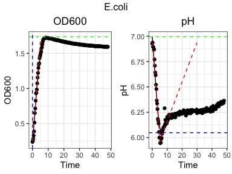
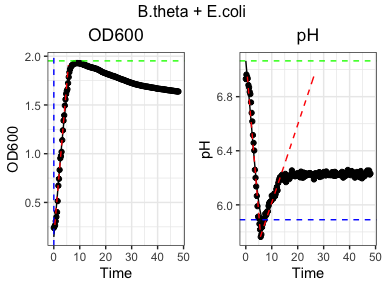
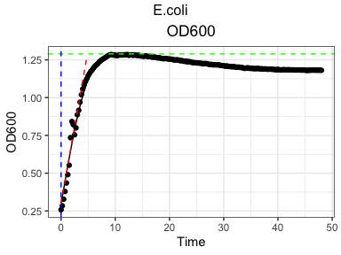
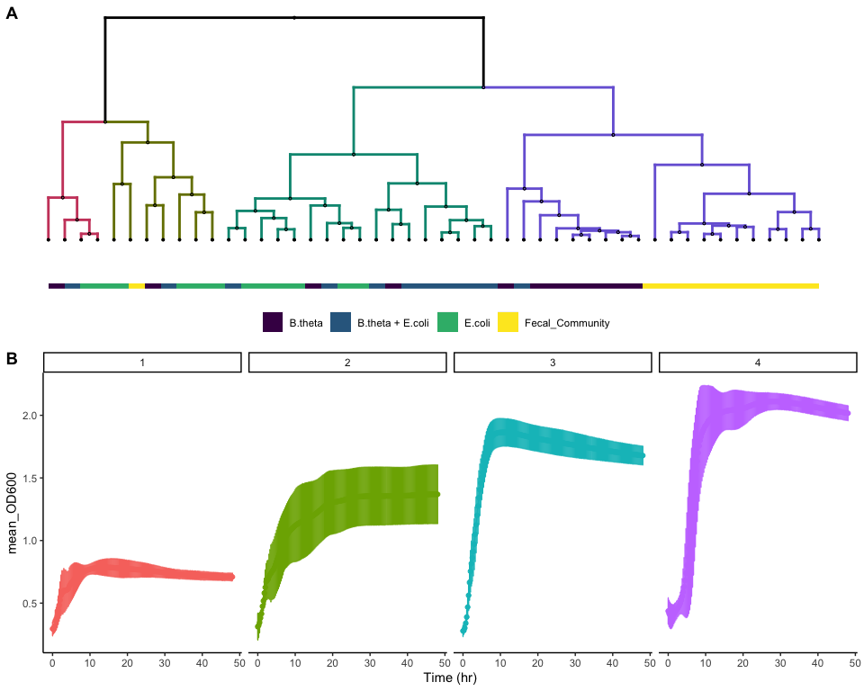

<!-- README.md is generated from README.Rmd. Please edit that file -->

# phgrofit

phgrofit is a R package designed to provide tools for making kinetic
analysis of OD600 and pH data easy.

The motivation for this package comes from the desire to process kinetic
pH and OD600 data in a somewhat similar manner to this
[paper](https://www.ncbi.nlm.nih.gov/pmc/articles/PMC3187081/).

In short, this package is designed to take OD600 and pH (gained using
the BCECF method described in the paper above) kinetic readouts in
either a 96 or 384 well format and process the data, extract
physiological parameters, and cluster these parameters to infer
relationships between compounds.

## Installation

``` r
devtools::install_github("Kaleido-Biosciences/phgrofit")
```

<!-- badges: start -->

[](https://github.com/Kaleido-Biosciences/phgrofit/actions)
<!-- badges: end -->

# Using this package

## Processing raw data with phgropro

Phgropro was built to take raw data that is exported from a biotek plate
reader and has very specific structure. The output of phgropro serves as
the input to all of the other phgrofit functions. Thus, you need to have
data in the format produced from phgropro to use the rest of the
phgrofit package.

The easiest way to get data in this format is to use the plate reader
protocols that are in the biotek\_plate\_reader\_protocols folder of
this repository and use the export provided. Unfortunatly, this will
only be usefull if the user happens to have acess to a Biotek Synergy H1
plate reader.

Alternatively, the user can generate a dataframe in R through their own
means that is compatible with the other phgrofit functions. Such a data
frame would need to have “Sample.ID”,“Time”,“OD600”,and “pH” as column
names, and each row should represent a timepoint for a given Sample.ID.
Other columns containing other metadata could be included as well.

Okay, let’s start by formatting our data using phgropro. Here we need to
specify the file path of a file containing the raw data.txt, the file
path of a file containing the metadata for each Sample.ID, and the plate
type that was used (96 or 384).

``` r
library(phgrofit)
#Loading the necessary data
phgropro_output = phgropro("tests/testdata/phgrofit_test_raw_data.txt",
                           "tests/testdata/phgrofit_test_metadata.csv",
                           Plate_Type = 384)
```

The resulting data frame looks like this:

``` r
print(head(phgropro_output))
#>    Sample.ID Study Plate Row Column Well  Compound Compound_Concentration
#> 1 G798.p1.A1  G798     1   A      1   A1 D-Glucose                    0.5
#> 2 G798.p1.A1  G798     1   A      1   A1 D-Glucose                    0.5
#> 3 G798.p1.A1  G798     1   A      1   A1 D-Glucose                    0.5
#> 4 G798.p1.A1  G798     1   A      1   A1 D-Glucose                    0.5
#> 5 G798.p1.A1  G798     1   A      1   A1 D-Glucose                    0.5
#> 6 G798.p1.A1  G798     1   A      1   A1 D-Glucose                    0.5
#>   Community       Media      Time OD600    pH
#> 1   B.theta Mega Medium 0.0000000 0.231 7.029
#> 2   B.theta Mega Medium 0.2333333 0.242 7.017
#> 3   B.theta Mega Medium 0.4833333 0.254 6.958
#> 4   B.theta Mega Medium 0.7333333 0.269 6.989
#> 5   B.theta Mega Medium 1.0000000 0.288 6.987
#> 6   B.theta Mega Medium 1.2500000 0.310 7.035
```

## Modeling with phgrofit

Now we can use the phgrofit to model each curve and extract the
physiologically relevant features.

``` r
#Conducting the modeling
phgrofit_output = phgrofit(phgropro_output)
```

This will produce the following data frame.

``` r
print(head(phgrofit_output))
#>    Sample.ID Study Plate Row Column Well    Compound Compound_Concentration
#> 1 G798.p1.A1  G798     1   A      1   A1   D-Glucose                    0.5
#> 2 G798.p1.B1  G798     1   B      1   B1   D-Glucose                    0.5
#> 3 G798.p1.C1  G798     1   C      1   C1 D-Galactose                    0.5
#> 4 G798.p1.D1  G798     1   D      1   D1 D-Galactose                    0.5
#> 5 G798.p1.E1  G798     1   E      1   E1 D-Arabinose                    0.5
#> 6 G798.p1.F1  G798     1   F      1   F1 D-Arabinose                    0.5
#>   Community       Media starting_od600 od600_lag_length od600_max_gr max_od600
#> 1   B.theta Mega Medium     0.04109686        0.9273289    0.3407801  2.134385
#> 2   B.theta Mega Medium     0.04346234        0.9774426    0.3481509  2.180504
#> 3   B.theta Mega Medium     0.04853609        1.5186534    0.3446916  2.166952
#> 4   B.theta Mega Medium     0.04491131        1.5531334    0.3439335  2.156492
#> 5   B.theta Mega Medium     0.08877224        2.0837220    0.2976787  2.151352
#> 6   B.theta Mega Medium     0.21506327        2.4986636    0.2971100  2.146010
#>   difference_between_max_and_end_od600 auc_od600 starting_pH
#> 1                            0.1696881  90.08715    7.160139
#> 2                            0.1341777  93.55510    7.169610
#> 3                            0.1776668  90.64111    7.112298
#> 4                            0.1989878  89.43158    7.104725
#> 5                            0.1520904  90.00384    7.085658
#> 6                            0.1748502  89.50497    7.096101
#>   max_acidification_rate   min_pH time_of_min_pH max_basification_rate   max_pH
#> 1             -0.2444190 5.605431       42.03333           0.022018604 7.160139
#> 2             -0.2411432 5.644260       47.28333           0.026570630 7.169610
#> 3             -0.2293043 5.683751       10.50000           0.017070186 7.112298
#> 4             -0.2297630 5.682021       10.75000           0.014576254 7.104725
#> 5             -0.1847080 5.760960       21.51667           0.004361004 7.085658
#> 6             -0.1749480 5.770639       23.26667           0.008963011 7.096101
#>   difference_between_end_and_min_pH   auc_pH percent_NA_od600 percent_NA_pH
#> 1                      1.171573e-02 280.9335                0             0
#> 2                      3.815244e-05 282.4024                0             0
#> 3                      3.815786e-02 283.6425                0             0
#> 4                      3.759313e-02 283.3362                0             0
#> 5                      5.531682e-02 285.4200                0             0
#> 6                      5.591642e-02 285.4526                0             0
#>   rmse_od600    rmse_pH
#> 1 0.05971485 0.04659988
#> 2 0.06193201 0.04570372
#> 3 0.05969187 0.04017724
#> 4 0.05984325 0.04046892
#> 5 0.04207331 0.02974554
#> 6 0.04723838 0.02561122
```

## Checking Model Fit

We can use the function flag to look at the data and see if there are
any obvious problems with our curves.

``` r
flag = flag(phgrofit_output)
print(head(flag))
#>    Sample.ID negligable_growth negative_lag_length missing_pH_data
#> 1 G798.p1.D7             FALSE                TRUE           FALSE
#> 2 G798.p1.H8             FALSE                TRUE           FALSE
#>   missing_od600_data starting_od600_higher_than_max
#> 1              FALSE                          FALSE
#> 2              FALSE                          FALSE
```

Here we can see there are a few wells that may be a problem. Based on
what flag returned, we can see that the lag length was calculated to be
negative.

Let’s look to see if this is actually a problem or not using the
model\_fit\_check function. This function will allow you to visually
check the model fit.

``` r
problem_wells = phgropro_output %>% 
  dplyr::filter(Sample.ID %in% flag$Sample.ID)

model_fit_check(problem_wells)
```

<!-- --><!-- -->

Here we can see that even though the lag length was estimated to be
below 0, it was very close to 0 and is an adequate representation of the
data.

What if we had a different problem? Let’s say for some reason all of the
pH data between 0.5 and 24 hrs was NA.

``` r
phgropro_prob = phgropro_output %>% 
  dplyr::mutate(pH = ifelse(dplyr::between(Time,0.5,24),NA,pH))

phgrofit_prob = phgrofit(phgropro_prob)

problem_flag = flag(phgrofit_prob)

print(head(problem_flag))
#>    Sample.ID negligable_growth negative_lag_length missing_pH_data
#> 1 G798.p1.A1             FALSE               FALSE            TRUE
#> 2 G798.p1.B1             FALSE               FALSE            TRUE
#> 3 G798.p1.C1             FALSE               FALSE            TRUE
#> 4 G798.p1.D1             FALSE               FALSE            TRUE
#> 5 G798.p1.E1             FALSE               FALSE            TRUE
#> 6 G798.p1.F1             FALSE               FALSE            TRUE
#>   missing_od600_data starting_od600_higher_than_max
#> 1              FALSE                          FALSE
#> 2              FALSE                          FALSE
#> 3              FALSE                          FALSE
#> 4              FALSE                          FALSE
#> 5              FALSE                          FALSE
#> 6              FALSE                          FALSE
```

Now we can see that there is missing\_pH data. This returns TRUE only if
25% or more of the data is NA. Let’s visually check using
model\_fit\_check now.

I didn’t mention this before, but if you pass a grouping\_vars argument
to model\_fit\_check, it will only return a randomly sampled plot from
the distinct conditions of your group. Let’s use this trick to look at a
distinct randomly sampled well with different values for
missing\_pH\_data

``` r
comb = dplyr::left_join(phgropro_prob,problem_flag,by = "Sample.ID")
model_fit_check(comb,"missing_pH_data")
```

<!-- -->

Here we can clearly see that there is as problem with the data, we are
missing a bunch of pH values!

You can also use the model\_fit\_check function independantly of flag.
Like I mentioned before, this function allows the user to specify
conditions to group by and subsequently plot a randomly sampled plot
from each distinct member of the grouping. This allows the user to check
as many conditions as they may wish. To check all of them, you can
simpily group by Sample.ID.

In this case, we will just check a plot from each community.

Note that there are a few features that are being extracted that aren’t
displayed on the graph because they were hard to overlay visually.

``` r
model_fit_check(phgropro_output,grouping_vars = c("Community"))
```

<!-- --><!-- --><!-- --><!-- -->

We can see from the above plots that the modeling appears to be working
well.

Also, please note that phgrofit returns the root-mean-square deviation
for both pH and OD600. This should allow the user to specifically look
into values that they think are too high.

## Transforming data

### Averaging

Oftentimes, the user may wish to average kinetic or modeling data. This
can easily be done with the avg\_phgropro and avg\_phgrofit functions
repectively. The user just has to specify the name of the colums that
they wish to group by and then take the average for. Here it makes sense
to group by Community and Compound

``` r
averaged_phgropro = avg_phgropro(phgropro_output,c("Community","Compound"))

averaged_phgrofit = avg_phgrofit(phgrofit_output,c("Community","Compound"))
```

### Scaling

For many applications such as heatmaps or PCA plots, the user will need
to scale the data. This can be accomplished with the scale\_phgrofit
function.

This function offers the option to scale for each specified group
independantly.

``` r
# All model parameters are scaled 
scaled = averaged_phgrofit %>%
    scale_phgrofit()

# All model parameters are scaled for each community independantly
scaled_by_community = averaged_phgrofit %>% 
    scale_phgrofit("Community")
```

## Visualizations

### Heatmapper

Now lets look to see how the data clusters. Here we can color by
compound and community. Be sure to use scaled data!

In this README, you will only see a static image because the function
returns a html file that can not be viewed in the format of this README.
When you go to use the function in your R session it will return a
interactive plotly image.

``` r
heatmapper(scaled,labels = c("Compound","Community"))
```


### PCA

We can generate a PCA plot using the PCA function. We can specify to
show the 95% confidence interval for any group. In this example, let’s
show the 95% confidence intervals for each community. Be sure to use
scaled data here!

``` r
p1 = PCA(scaled,"Community")
#> Warning: Ignoring unknown aesthetics: text
p1
```

<!-- -->

### Dendrogram and associated kinetic curves

It is often times hard to look at a dendrogram and get a good idea about
what the clusters actually mean. The dendrospect function allows the
user to color the dendrogram into k number of cluster and look at the
average kinetic pH and OD600 profile within each cluster. The function
also allows for the user to label the dendogram by a colored bar for a
specified variable.

``` r
p1 = dendrospect(scaled,averaged_phgropro,"Community", k = 4)

p1
```

<!-- -->

### Looking closer at data corresponding with clusters

Oftentimes the user will want to be able to inspect the data displayed
in the above plot more thoroughly. That is the purpose of the
dendropsect\_kinetic and dendorospect\_model functions. The
dendrospect\_kinetic function returns kinetic data with the
dendogram\_cluster each observation belongs to.

``` r
d1 = dendrospect_kinetic(averaged_phgropro,scaled,k=4)

DT::datatable(head(d1))
#> PhantomJS not found. You can install it with webshot::install_phantomjs(). If it is installed, please make sure the phantomjs executable can be found via the PATH variable.
```

<div id="htmlwidget-21e4bd450b45d6959473" style="width:100%;height:auto;" class="datatables html-widget"></div>
<script type="application/json" data-for="htmlwidget-21e4bd450b45d6959473">{"x":{"filter":"none","vertical":false,"data":[["1","2","3","4","5","6"],["B.theta,D-Arabinose","B.theta,D-Arabinose","B.theta,D-Arabinose","B.theta,D-Arabinose","B.theta,D-Arabinose","B.theta,D-Arabinose"],["B.theta","B.theta","B.theta","B.theta","B.theta","B.theta"],["D-Arabinose","D-Arabinose","D-Arabinose","D-Arabinose","D-Arabinose","D-Arabinose"],[0,0.233333333333333,0.483333333333333,0.733333333333333,1,1.25],[0.28675,0.26575,0.25425,0.25,0.253,0.26525],[0.140883817381557,0.089544681584112,0.0539343737023678,0.0274469184669852,0.0114600756251141,0.00788986691902976],[7.0135,6.9895,6.9985,6.979,6.97175,6.98975],[0.0542248405560896,0.0340636658821876,0.0306431068920888,0.00941629792788369,0.0130479883507,0.01598697386416],["1","1","1","1","1","1"]],"container":"<table class=\"display\">\n  <thead>\n    <tr>\n      <th> <\/th>\n      <th>Sample.ID<\/th>\n      <th>Community<\/th>\n      <th>Compound<\/th>\n      <th>Time<\/th>\n      <th>mean_OD600<\/th>\n      <th>sd_OD600<\/th>\n      <th>mean_pH<\/th>\n      <th>sd_pH<\/th>\n      <th>dendrogram_cluster<\/th>\n    <\/tr>\n  <\/thead>\n<\/table>","options":{"columnDefs":[{"className":"dt-right","targets":[4,5,6,7,8]},{"orderable":false,"targets":0}],"order":[],"autoWidth":false,"orderClasses":false}},"evals":[],"jsHooks":[]}</script>

The dendrospect\_model function returns the modeling data with the
dendogram cluster each observation belongs to.

``` r
d2 = dendrospect_model(scaled,k = 8)
DT::datatable(d2)
```

<div id="htmlwidget-f33c01100a406398452c" style="width:100%;height:auto;" class="datatables html-widget"></div>
<script type="application/json" data-for="htmlwidget-f33c01100a406398452c">{"x":{"filter":"none","vertical":false,"data":[["1","2","3","4","5","6","7","8","9","10","11","12","13","14","15","16","17","18","19","20","21","22","23","24","25","26","27","28","29","30","31","32","33","34","35","36","37","38","39","40","41","42","43","44","45","46","47","48"],["B.theta,D-Arabinose","B.theta,D-Fructose","B.theta,D-Galactose","B.theta,D-Glucose","B.theta,D-Lactose","B.theta,D-Mannose","B.theta,D-Xylose","B.theta,Fructooligosaccharide","B.theta,Galactooligosaccharide","B.theta,L-Arabinose","B.theta,No added carbon","B.theta,Xylooligosaccharide","B.theta + E.coli,D-Arabinose","B.theta + E.coli,D-Fructose","B.theta + E.coli,D-Galactose","B.theta + E.coli,D-Glucose","B.theta + E.coli,D-Lactose","B.theta + E.coli,D-Mannose","B.theta + E.coli,D-Xylose","B.theta + E.coli,Fructooligosaccharide","B.theta + E.coli,Galactooligosaccharide","B.theta + E.coli,L-Arabinose","B.theta + E.coli,No added carbon","B.theta + E.coli,Xylooligosaccharide","E.coli,D-Arabinose","E.coli,D-Fructose","E.coli,D-Galactose","E.coli,D-Glucose","E.coli,D-Lactose","E.coli,D-Mannose","E.coli,D-Xylose","E.coli,Fructooligosaccharide","E.coli,Galactooligosaccharide","E.coli,L-Arabinose","E.coli,No added carbon","E.coli,Xylooligosaccharide","Fecal_Community,D-Arabinose","Fecal_Community,D-Fructose","Fecal_Community,D-Galactose","Fecal_Community,D-Glucose","Fecal_Community,D-Lactose","Fecal_Community,D-Mannose","Fecal_Community,D-Xylose","Fecal_Community,Fructooligosaccharide","Fecal_Community,Galactooligosaccharide","Fecal_Community,L-Arabinose","Fecal_Community,No added carbon","Fecal_Community,Xylooligosaccharide"],["B.theta","B.theta","B.theta","B.theta","B.theta","B.theta","B.theta","B.theta","B.theta","B.theta","B.theta","B.theta","B.theta + E.coli","B.theta + E.coli","B.theta + E.coli","B.theta + E.coli","B.theta + E.coli","B.theta + E.coli","B.theta + E.coli","B.theta + E.coli","B.theta + E.coli","B.theta + E.coli","B.theta + E.coli","B.theta + E.coli","E.coli","E.coli","E.coli","E.coli","E.coli","E.coli","E.coli","E.coli","E.coli","E.coli","E.coli","E.coli","Fecal_Community","Fecal_Community","Fecal_Community","Fecal_Community","Fecal_Community","Fecal_Community","Fecal_Community","Fecal_Community","Fecal_Community","Fecal_Community","Fecal_Community","Fecal_Community"],["D-Arabinose","D-Fructose","D-Galactose","D-Glucose","D-Lactose","D-Mannose","D-Xylose","Fructooligosaccharide","Galactooligosaccharide","L-Arabinose","No added carbon","Xylooligosaccharide","D-Arabinose","D-Fructose","D-Galactose","D-Glucose","D-Lactose","D-Mannose","D-Xylose","Fructooligosaccharide","Galactooligosaccharide","L-Arabinose","No added carbon","Xylooligosaccharide","D-Arabinose","D-Fructose","D-Galactose","D-Glucose","D-Lactose","D-Mannose","D-Xylose","Fructooligosaccharide","Galactooligosaccharide","L-Arabinose","No added carbon","Xylooligosaccharide","D-Arabinose","D-Fructose","D-Galactose","D-Glucose","D-Lactose","D-Mannose","D-Xylose","Fructooligosaccharide","Galactooligosaccharide","L-Arabinose","No added carbon","Xylooligosaccharide"],[0.119908892364506,0.18125768695255,0.057065323583808,0.0422495595276505,0.143535682234592,0.0686932606624444,0.195793131599783,0.247849376124597,0.0917451630419585,0.117285262373426,0.2301266802516,0.0783987628836204,0.272635020070636,0.249552336036227,0.222873720139175,0.193057299659754,0.168758238220086,0.170322545755119,0.196526916728111,0.323223018784917,0.215418639393637,0.146598383382543,0.293563625519284,0.195984226046538,0.380519244572537,0.295797853821322,0.252632185599964,0.298805551649404,0.251069691091793,0.24278118525092,0.253371146021809,0.397656564235425,0.290189563150637,0.22737336736477,0.339826428347579,0.333577173314703,0.517337862937691,0.453835446392425,0.487622037098121,0.429830682762679,0.449659788840765,0.463376885285846,0.483933281862733,0.425353914004462,0.405792834399865,0.457577807072389,0.501313486337189,0.467129963307865],[[0.101757037353401],[-0.254286385233085],[-0.159692864594515],[-0.426945310090673],[-0.141479407805416],[-0.27236451084215],[0.151724514118973],[-0.299443302939867],[-0.339500235522193],[-0.112076692542956],[-0.141596558106977],[-0.439582856623545],[0.0221189985870147],[-0.821442996469093],[-0.802323413771836],[-0.82779128343741],[-0.82145374084327],[-0.815476255132136],[-0.799416628987018],[0.240947599699449],[-0.826465145445172],[-0.824278295300399],[-0.828555902910271],[-0.826787110378042],[2.39941610551049],[-0.828555154086621],[-0.828555392959899],[-0.828024277127931],[-0.828547215040963],[-0.828556085499963],[-0.828555902910271],[-0.828548637225191],[-0.828555902910271],[-0.828535702241908],[-0.828555902910271],[-0.828555902910271],[2.64151992707222],[1.46745612983245],[1.36973715964227],[1.20293349577023],[1.06568749063404],[1.30503556173024],[1.62989415110539],[1.02956648122377],[1.04349561019087],[1.4885841945403],[1.49806064124484],[1.23656987454364]],[[0.596612245502237],[1.2024705570676],[1.20163237287568],[1.18450559979138],[1.14729021806719],[1.19860927032171],[0.520903300745457],[-1.50588758196328],[0.136180210620725],[1.1300194107676],[-2.38376182065936],[0.805728202908832],[-0.441148281020466],[0.738070414286487],[0.304295766666611],[1.2801329463696],[0.495311980424905],[0.609155325593315],[-0.43719222289953],[-1.35880667255399],[-0.216204679265065],[0.691331581916077],[-1.66940321809459],[0.180693125502957],[-1.388887734557],[0.402152526800563],[-0.115558767852778],[0.841261765029107],[0.104292284386242],[-0.0170832885785814],[-0.942240076679137],[-1.98278140160845],[-0.596978680684678],[0.348820350722977],[-1.99592800788506],[-0.9253718480322],[-0.565256202336578],[0.0333471731154656],[0.664781190618304],[0.916507511448598],[0.886870690837507],[0.0335889193615982],[-0.656922282360243],[0.77216367757873],[0.680886494869326],[-0.26237628277066],[-1.98441857459177],[0.338592510196631]],[[0.79072503971255],[0.934851538800366],[0.837199632061655],[0.81453119744592],[0.875205244706069],[0.890946671334113],[1.16102182770395],[-0.568322374358821],[0.231710580095437],[0.827633564924134],[-2.41498045937581],[0.508278435034119],[0.897980054489389],[0.348986026937197],[0.243922843571207],[0.193084281480416],[0.0965318258542904],[0.482740916489275],[0.363744069894662],[-1.00609748817477],[-0.260475347810108],[0.187735774566962],[-2.41866367408166],[0.366703708341144],[-1.13154036030415],[-0.0427352838238974],[-0.298195719561984],[-0.201214653037395],[-0.102671788629415],[-0.0883674839379253],[-0.479000434903879],[-2.66561163535871],[-1.35892391551609],[-0.217231515306489],[-2.55704912430417],[-1.84362623803933],[1.21877958683515],[0.630557516341617],[0.596106381038091],[0.70375682531993],[0.626703486399962],[0.56479620046492],[0.49887659975969],[0.493714377571351],[0.517098456568725],[0.426600313222377],[-0.358032417278347],[0.682216936838262]],[[0.0950429012323675],[0.287072117730935],[0.501780084213155],[0.210059472040084],[0.199765556622709],[0.103712248223867],[1.75672356850802],[-1.75549624606412],[-0.32140091931607],[0.265845574069024],[0.0313842458731131],[1.12021459997117],[0.382241617693469],[1.42135351342892],[1.75239736565041],[2.44270053353587],[0.457823056535128],[2.10916905181039],[1.12133742246941],[-1.00030206948653],[-0.757909858952431],[2.17435191544182],[-0.748851668505102],[1.85747257362418],[-0.638430494853427],[0.0769631956780266],[0.109463384906655],[-0.00205279390539305],[-0.57089633256881],[0.23954628100028],[-1.04910543265955],[-1.19323075524494],[-0.537656833661163],[-0.339412965037844],[-1.02676654890519],[-0.975838246336807],[-0.171714135344703],[-0.139653924083317],[-0.696763824622818],[-0.713807931251497],[-0.830204360259777],[-0.592280096057005],[-0.649038248315147],[-0.970369675784554],[-0.645762966078717],[-0.682610263473479],[-0.841530153106467],[-0.865333536384167]],[[0.84968213871683],[1.08248755396667],[0.879821500797662],[0.945027944175847],[0.99187662809467],[1.02458952721506],[0.996738831847684],[-0.947970745060084],[0.358079682114972],[0.913102667480592],[-2.51202658335041],[0.54793319790347],[0.883295537438838],[0.484589684444168],[0.280267713932415],[0.152039653655908],[0.27232700125342],[0.547981012692232],[0.427825430968531],[-1.21460451782061],[-0.0105792879818723],[0.149644257718824],[-2.33957120129033],[0.362842962125455],[-1.64070992673329],[0.164428251111516],[-0.1644563228314],[0.0220166547784583],[0.147686330391989],[0.0494010676591946],[-0.315911369764931],[-2.57651259190297],[-1.21690330752598],[-0.00301922181907706],[-2.49147638696168],[-1.67733138650744],[0.689533879724983],[0.420026643963666],[0.481861041895614],[0.637890542813092],[0.638695363620591],[0.420775225167838],[0.186876151158726],[0.492606222433304],[0.472630629912991],[0.208478438597671],[-0.640133848234233],[0.568147328011416]],[7.07395607415534,7.13346310717631,7.10750872227274,7.14789878748212,7.11661359928265,7.12590854890336,7.0518384305166,6.9916957804883,7.06826613764335,7.1097384328757,6.99470918480607,7.09902139890208,6.9727022522405,7.06615507594421,7.06382621110503,7.04624938793717,7.05851193064017,7.04498896156632,7.03023885964446,6.95614133942445,6.98379186731147,7.06161973093667,6.95663203705576,7.01127105997413,6.92765935793108,7.00037897472579,6.99138741608991,6.98006895599908,7.01563705146768,6.98810767781028,6.99896696515793,6.93033687704216,6.92849088206055,6.99479592687877,6.925406149114,6.89593912941461,7.01422805722945,7.029551342078,7.03020983794568,7.06065037428171,7.06142405890271,7.00501656697269,7.00710083084481,7.06453829718503,7.08044956507056,7.00912905224722,7.03301339978141,7.03173712162257],[[-0.14214764043592],[-1.02179918442905],[-0.80689489445106],[-0.996293385507587],[-0.916605465209417],[-0.914246693556897],[-0.00493308807235611],[1.54229126068868],[0.381520279208743],[-0.975263186279491],[1.98524646640605],[-0.537154388949196],[0.512557661012856],[-0.736498087888535],[-0.427949889147513],[-0.752570754929034],[-0.471024345313182],[-0.273376076442953],[0.171766615610349],[1.22477580609029],[0.836948435065826],[-0.771013153116255],[1.83664091186951],[0.375181429006284],[1.39011775025205],[-0.3859749645722],[0.000449227638766079],[-0.48085725660252],[-0.29888835127898],[0.281346401040873],[0.388434931174963],[1.9355396326782],[1.12758372181141],[-0.483509313898145],[2.04937663615175],[1.58176001675127],[-0.0775183361898673],[-0.779009360280886],[-0.875237167862983],[-1.05508971981473],[-1.31829746689364],[-0.217536858259879],[-0.0006954976888307],[-1.10903829267469],[-0.866181953597009],[-0.72993609418788],[1.98662665649612],[-1.1826229714233]],[[-0.809589158817351],[-1.2841808889084],[-0.996093924801397],[-1.1934110021998],[-1.1335886417012],[-1.22001365190591],[-0.924180474915104],[0.462217232046546],[-0.189532961272644],[-1.31550247452739],[2.10336919457033],[-0.733218558218654],[-0.628329561459264],[-0.360673294119686],[-0.197088184821232],[-0.170871282893041],[-0.264907920326898],[-0.0758836684719604],[-0.082812368535251],[0.863617129593836],[0.797156455871465],[-0.414391944880949],[2.13653971487595],[-0.0464427663012078],[0.78603461246852],[-0.0521920372186522],[0.190586312010273],[0.188240237039976],[-0.086403427486701],[0.13024449753112],[-0.0847444630070054],[2.11714455011627],[1.58997506354324],[-0.0578238033038778],[2.14540126295151],[1.84732753346218],[-0.505808332953156],[-0.408292326748258],[-0.483777851020916],[-0.519502569286594],[-0.761154253886168],[-0.277145694523764],[-0.393052088302005],[-0.511679474029887],[-0.463766881373577],[-0.256229939139068],[2.45871963734273],[-0.914287562067019]],[[0.186291274602821],[2.268960832554],[-0.440909915428277],[2.07257079790211],[0.265782479104774],[2.36715584987994],[-0.19776034871642],[1.69787108099487],[1.88522093944849],[2.36715584987994],[-0.440909915428277],[-0.450261821840272],[0.0880962572768788],[-0.712115201376118],[-0.688735435346131],[-0.740170920612101],[-0.670031622522142],[-0.684059482140134],[-0.590540418020189],[1.30010332827137],[2.36715584987994],[-0.70743924817012],[-0.735494967406104],[1.01019422949954],[0.284798022142497],[-0.72614306099411],[-0.712115201376118],[-0.786930452672074],[-0.698087341758126],[-0.646651856492156],[-0.534428979548222],[-0.632623996874164],[-0.829014031526049],[-0.735494967406104],[-0.754198780230093],[-0.829014031526049],[0.228998313884263],[-0.28192750642437],[-0.324011085278346],[-0.356742757720327],[-0.356742757720327],[-0.225816067952403],[-0.122945097420464],[-0.380122523750313],[-0.314659178866351],[-0.328687038484343],[-0.459613728252266],[-0.295955366042362]],[[-1.37472296586626],[-0.54017021823407],[-0.813946070993484],[-0.604720363987756],[-0.721319660455693],[-0.873799141346741],[-1.22709997496454],[-0.993715260433225],[-0.980832594290478],[-0.371869040153152],[-0.419167408969785],[-0.979594277259141],[-1.28370155383466],[0.761244830739984],[0.658866036216136],[0.989595274938652],[0.589355966856311],[-0.251286378890064],[0.305068367391147],[-1.0231631137912],[-1.49593979515906],[0.932992510917625],[-0.324112280269011],[-1.41655391135531],[-1.23917609986136],[0.449772274539535],[0.208613136397718],[0.283066503383653],[0.361225211116151],[0.102627760564896],[0.740383902019377],[-1.30259047098665],[-0.872466404073181],[0.36710885722755],[-1.27667456804508],[-1.06366899038902],[0.516170774797696],[1.18265391602775],[1.27755645402487],[1.73748675049317],[1.53938155450024],[0.987715713267952],[1.22210362933449],[1.33474337671256],[1.3695655084501],[0.680884071006981],[1.18258707556089],[1.6695210871235]],[[-0.102948246946581],[0.158669905539745],[0.0445634229497152],[0.222135277946371],[0.0845923234178233],[0.125456863687639],[-0.200186787878036],[-0.464599382276615],[-0.12796362080176],[0.0543661763204178],[-0.159613749132906],[0.00724955016760761],[-0.548102987096465],[-0.13724474327545],[-0.147483420717201],[-0.22475858921927],[-0.170847251283596],[-0.230299958058326],[-0.295147661226811],[-0.620911782871837],[-0.499348336438146],[-0.157184043245975],[0.0520899942985519],[-0.378538152309366],[-0.559626200833643],[-0.426424378100369],[-0.465955082940927],[-0.515715833353589],[-0.359343402204582],[-0.480374203266664],[-0.432632170955793],[-0.721946171011246],[-0.727357250956988],[-0.450969824055716],[-0.427490856078705],[-0.691568064925311],[-0.319007596147522],[1.51834000161482],[0.24666491989113],[0.645483914420815],[-0.0157899699976902],[1.05056837286791],[0.07151421304418],[0.118695784487029],[0.122272851805707],[0.634457705039997],[6.10861150733003],[-0.206353067222485]],[[-0.764164411207503],[-0.892592278418314],[-0.792463487830166],[-0.870796207330738],[-0.838704538753003],[-0.894322362618912],[-0.707481496915606],[-0.874656470053676],[-0.854850146760532],[-0.894322362618912],[-0.427722012326724],[-0.654513858971281],[-0.688597303066902],[-0.397424688101347],[-0.413096993298017],[-0.296806669473683],[-0.245981766335118],[-0.639999972820796],[-0.536057881377239],[-0.782261526680405],[-0.894322362618912],[-0.205543126397882],[-0.377670526163339],[-0.853147066477392],[-0.667891478593566],[-0.0957059013288058],[-0.211074372173134],[-0.19444344322898],[-0.135790901756516],[-0.220719809956709],[0.0338621446061446],[-0.718537591335473],[-0.32993381124991],[-0.227283566852976],[-0.566248132663856],[-0.469876780808228],[0.696709135265502],[2.13477821424111],[1.62227407036798],[1.82565972731088],[1.51125311055991],[1.83213908961167],[1.47906666840462],[1.53660273976506],[1.51823446467186],[1.63168227328557],[2.12151398288731],[1.69122968558693]],[[-1.24941914001727],[-1.56994794987393],[-1.32964325475808],[-1.49895238946723],[-1.4775865236599],[-1.49538276640209],[-1.28476574560955],[0.5550463013786],[-0.569479099932654],[-1.51064798781185],[1.6337985015453],[-1.15506798583643],[-0.96055026776545],[-0.596797144123565],[-0.420630679275291],[-0.30990108611874],[-0.35018132302994],[-0.583718399287187],[-0.440819897878023],[0.628060367940633],[0.196062451733073],[-0.440646548065151],[1.69680973660515],[-0.715467983666099],[0.662720845146455],[-0.0950487715110818],[-0.0405049464979363],[-0.0142877389053158],[-0.153466471665783],[-0.0295888103968697],[0.00668262556701138],[1.3483414328143],[1.07658437387663],[-0.286921850839271],[1.48007837259192],[1.27537920934848],[-0.0347990385483922],[0.948295793433266],[0.467702457081299],[0.569900490181806],[0.18123667742346],[0.541692197759506],[0.553923681667399],[0.433346044274062],[0.42122234331163],[0.756265648909372],[3.06002516429546],[0.121049084058206]],[0,0,0,0,0,0,0,0,0,0,0,0,0,0,0,0,0,0,0,0,0,0,0,0,0,0,0,0,0,0,0,0,0,0,0,0,0,0,0,0,0,0,0,0,0,0,0,0],[0,0,0,0,0,0,0,0,0,0,0,0,0,0,0,0,0,0,0,0,0,0,0,0,0,0,0,0,0,0,0,0,0,0,0,0,0,0,0,0,0,0,0,0,0,0,0,0],[0.0443152401731111,0.0702957178683333,0.0622705146796004,0.0620652576112746,0.0644983337732415,0.0627121330766734,0.0388232235522121,0.0239084804223129,0.0377870429161044,0.0631755605014007,0.00741557392978229,0.0546689637862144,0.0314085549251796,0.0277018413438058,0.028081518871978,0.0321275729377059,0.0273084483851358,0.0277020356462122,0.020256979318745,0.0269425111874189,0.0160253415476519,0.0245617745794165,0.0151990571051495,0.0296503403790602,0.0226478753922934,0.0187309008060044,0.0192540678441023,0.030085032960865,0.0197269167418667,0.0219225087147503,0.014361158405678,0.0192713441241152,0.0221490253362153,0.0197952110790152,0.0120678594723452,0.0248302444326299,0.0255788567125545,0.0430620939439958,0.0633129692666183,0.0739081996903321,0.0728294832444813,0.0393307318145052,0.0219556150607556,0.0748382346378622,0.067476429831622,0.0371166550948955,0.0191284686947881,0.0490189033571478],[0.0285944537723449,0.0471300074100574,0.041427658388664,0.0489316949588352,0.0419536303309549,0.0463621576362929,0.0253996933049379,0.0263972939039719,0.0265033605418603,0.044683604041528,0.0153766600525625,0.0393624044516681,0.0224045143796277,0.0385024235874749,0.0454949984371727,0.0403246234753001,0.030572362800942,0.0360635639752324,0.0293848067646929,0.0229779955436563,0.0248801643394983,0.0385494519843048,0.0149482934327378,0.0264667028084048,0.0200863084435355,0.0298669717511843,0.0303615162064291,0.0344335968724834,0.0300267083475528,0.0281760180034255,0.025683111083191,0.0163571146946811,0.021264521947961,0.0328548629867335,0.0155663698871024,0.0163064142385046,0.0320499652201312,0.0499169927346829,0.0549509929089287,0.0667129143926347,0.0680510819264717,0.032772846883868,0.0257945843580831,0.0651348073832789,0.0528844141225175,0.0551959629715746,0.0291813733267069,0.0548646156352285],["2","2","2","2","2","2","2","7","1","2","6","2","2","4","4","4","4","4","4","7","7","4","6","1","8","4","4","4","4","4","4","6","8","4","6","8","3","3","3","3","3","3","3","3","3","3","5","3"]],"container":"<table class=\"display\">\n  <thead>\n    <tr>\n      <th> <\/th>\n      <th>Sample.ID<\/th>\n      <th>Community<\/th>\n      <th>Compound<\/th>\n      <th>starting_od600<\/th>\n      <th>od600_lag_length<\/th>\n      <th>od600_max_gr<\/th>\n      <th>max_od600<\/th>\n      <th>difference_between_max_and_end_od600<\/th>\n      <th>auc_od600<\/th>\n      <th>starting_pH<\/th>\n      <th>max_acidification_rate<\/th>\n      <th>min_pH<\/th>\n      <th>time_of_min_pH<\/th>\n      <th>max_basification_rate<\/th>\n      <th>max_pH<\/th>\n      <th>difference_between_end_and_min_pH<\/th>\n      <th>auc_pH<\/th>\n      <th>percent_NA_od600<\/th>\n      <th>percent_NA_pH<\/th>\n      <th>rmse_od600<\/th>\n      <th>rmse_pH<\/th>\n      <th>dendrogram_cluster<\/th>\n    <\/tr>\n  <\/thead>\n<\/table>","options":{"columnDefs":[{"className":"dt-right","targets":[4,5,6,7,8,9,10,11,12,13,14,15,16,17,18,19,20,21]},{"orderable":false,"targets":0}],"order":[],"autoWidth":false,"orderClasses":false}},"evals":[],"jsHooks":[]}</script>

# OD600 data alone

Say you aren’t interested in pH data and you would like to use these
tools with just OD600 data. That is exactly the case that grofit was
made to solve. It operates on the same type of data as phgrofit, just
without the pH column. Right now there isn’t a dedicated parser
homologous to phgropro, but this may be a feature in the future.

``` r
#Pretending that we only have OD600 data
gropro_output = phgropro_output %>% 
  dplyr::select(-pH)

grofit_output = gropro_output %>% 
  grofit()
```

We are able to detect whether you have used phgrofit or grofit by the
presence or absence of columns that only occur in phgrofit. This means
that you can use all of the functions that you would use with phgrofit
with grofit instead.

Let’s first look at a randomly sampled model fit from each community

``` r
model_fit_check(gropro_output,"Community")
```

<!-- --><!-- --><!-- --><!-- -->

Let’s average and scale the grofit data just like we would with
phgrofit.

``` r
avg_grofit = avg_phgrofit(grofit_output,c("Community","Compound"))
avg_gropro = avg_phgropro(gropro_output,c("Community","Compound"))

scaled_grofit = scale_phgrofit(avg_grofit)
```

Now let’s look at a PCA

``` r
PCA(scaled_grofit,"Community")
#> Warning: Ignoring unknown aesthetics: text
```

<!-- -->

Here we can see similar clustering to what we had observed previously.
Now we can make a heatmap.

``` r
heatmapper(scaled_grofit,c("Community","Compound"))
```


And we can even make a dendrogram with associated kinetic profiles.

``` r
dendrospect(scaled_grofit,avg_gropro,"Community",k=4)
```

<!-- -->

Lastly, if you want to see which data corresponds with a cluster, you
can use the other dendrospect functions.

``` r
grofit_clusters = dendrospect_model(scaled_grofit,k = 4)
gropro_clusters = dendrospect_kinetic(phgropro_data = avg_gropro,phgrofit_data = scaled_grofit, k =3)

DT::datatable(head(grofit_clusters,5))
```

<div id="htmlwidget-856a7d6e8d4d2a689ab6" style="width:100%;height:auto;" class="datatables html-widget"></div>
<script type="application/json" data-for="htmlwidget-856a7d6e8d4d2a689ab6">{"x":{"filter":"none","vertical":false,"data":[["1","2","3","4","5"],["B.theta,D-Arabinose","B.theta,D-Fructose","B.theta,D-Galactose","B.theta,D-Glucose","B.theta,D-Lactose"],["B.theta","B.theta","B.theta","B.theta","B.theta"],["D-Arabinose","D-Fructose","D-Galactose","D-Glucose","D-Lactose"],[0.119908892364506,0.18125768695255,0.057065323583808,0.0422495595276505,0.143535682234592],[[0.101757037353401],[-0.254286385233085],[-0.159692864594515],[-0.426945310090673],[-0.141479407805416]],[[0.596612245502237],[1.2024705570676],[1.20163237287568],[1.18450559979138],[1.14729021806719]],[[0.79072503971255],[0.934851538800366],[0.837199632061655],[0.81453119744592],[0.875205244706069]],[[0.0950429012323675],[0.287072117730935],[0.501780084213155],[0.210059472040084],[0.199765556622709]],[[0.84968213871683],[1.08248755396667],[0.879821500797662],[0.945027944175847],[0.99187662809467]],[0,0,0,0,0],[0.0443152401731111,0.0702957178683333,0.0622705146796004,0.0620652576112746,0.0644983337732415],["4","4","4","4","4"]],"container":"<table class=\"display\">\n  <thead>\n    <tr>\n      <th> <\/th>\n      <th>Sample.ID<\/th>\n      <th>Community<\/th>\n      <th>Compound<\/th>\n      <th>starting_od600<\/th>\n      <th>od600_lag_length<\/th>\n      <th>od600_max_gr<\/th>\n      <th>max_od600<\/th>\n      <th>difference_between_max_and_end_od600<\/th>\n      <th>auc_od600<\/th>\n      <th>percent_NA_od600<\/th>\n      <th>rmse_od600<\/th>\n      <th>dendrogram_cluster<\/th>\n    <\/tr>\n  <\/thead>\n<\/table>","options":{"columnDefs":[{"className":"dt-right","targets":[4,5,6,7,8,9,10,11]},{"orderable":false,"targets":0}],"order":[],"autoWidth":false,"orderClasses":false}},"evals":[],"jsHooks":[]}</script>
DT::datatable(head(gropro_clusters,5))
<div id="htmlwidget-0161a8a171569e055c44" style="width:100%;height:auto;" class="datatables html-widget"></div>
<script type="application/json" data-for="htmlwidget-0161a8a171569e055c44">{"x":{"filter":"none","vertical":false,"data":[["1","2","3","4","5"],["B.theta,D-Arabinose","B.theta,D-Arabinose","B.theta,D-Arabinose","B.theta,D-Arabinose","B.theta,D-Arabinose"],["B.theta","B.theta","B.theta","B.theta","B.theta"],["D-Arabinose","D-Arabinose","D-Arabinose","D-Arabinose","D-Arabinose"],[0,0.233333333333333,0.483333333333333,0.733333333333333,1],[0.28675,0.26575,0.25425,0.25,0.253],[0.140883817381557,0.089544681584112,0.0539343737023678,0.0274469184669852,0.0114600756251141],["3","3","3","3","3"]],"container":"<table class=\"display\">\n  <thead>\n    <tr>\n      <th> <\/th>\n      <th>Sample.ID<\/th>\n      <th>Community<\/th>\n      <th>Compound<\/th>\n      <th>Time<\/th>\n      <th>mean_OD600<\/th>\n      <th>sd_OD600<\/th>\n      <th>dendrogram_cluster<\/th>\n    <\/tr>\n  <\/thead>\n<\/table>","options":{"columnDefs":[{"className":"dt-right","targets":[4,5,6]},{"orderable":false,"targets":0}],"order":[],"autoWidth":false,"orderClasses":false}},"evals":[],"jsHooks":[]}</script>

# Function List

1.  phgropro() : Used to process kinetic pH and OD600 data resulting
    from a standardized export from the Biotek Gen5 software and combine
    with user supplied metadata.

2.  phgrofit() : Takes the output of phgrofit::phgropro()) and extracts
    relevant physiological features by fitting a smoothing spline.

3.  model\_fit\_check(): Allows for visual checking of the modeling fit
    by printing graphs for the combination of conditions the user
    supplies.

4.  avg\_phgropro(): Allows the user to easily average phgropro data for
    the specified grouping.

5.  avg\_phgrofit(): Allows the user to easily average phgrofit data for
    the specified grouping.

6.  scale\_phgrofit(): Allows the user to easily scale phgrofit modeling
    data. Can be done individually per specified group

7.  heatmapper(): Creates an interactive heat map with associated
    dendogram that has colored bars based on user input.

8.  PCA(): Visualizes the first two principle components and the 95%
    confidence interval for any specified group.

9.  dendrospect(): Returns a plot visualizing a dendogram that is
    colored by cluster number, and the corresponding average kinetic
    curves for each cluster.

10. dendrospect\_kinetic(): Returns a data frame of the kinetic data
    with the cluster that each Sample.ID would correspond to based on
    hierchical clustering of the modeling data.

11. dendrospect\_model(): Returns a data frame with the modeling data
    from phgrofit with the cluster that each Sample.ID would correspond
    to based on hierchical clustering of the data.

12. grofit(): Extracts relevant physiological features for just OD600 by
    fitting a smoothing spline. All other functions expecting
    phgrofit\_output can also take grofit\_output instead.
